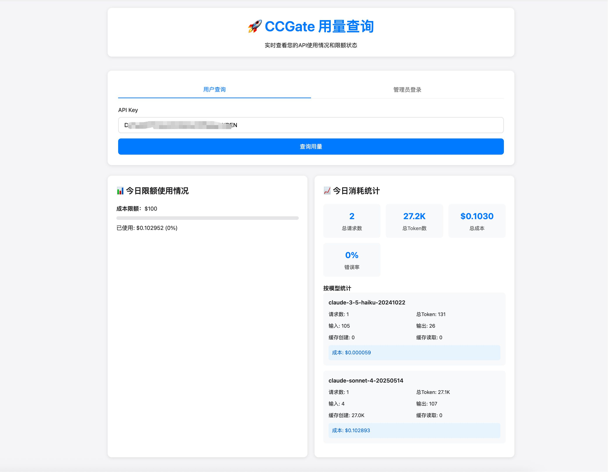

# CCGate

Claude code API 的二次分发反向代理服务器，支持配置多个上游（Anthropic官方，各家Claude code镜像站），多种负载均衡算法，支持配置多个租户、以及各个租户的权限，各个租户可以查看自己用量

一个疑问解答：已经有了强大的 [Wei-Shaw/claude-relay-service](https://github.com/Wei-Shaw/claude-relay-service) 搭建Claude code 镜像站，为什么还需要本项目？

因为 CRS 的上游仅支持配置 Claude 账号登录，所以必须买官方套餐，不支持配置镜像站的API。在一个场景下，**即几个朋友或家人用量不大，又不想经常直面Claude封号不稳定问题** (需要经常找可用区域的信用卡和IP)，想把这个问题交给镜像站，就可以买各家 Claude code 镜像站的API，然后使用本项目进行二次镜像

## ✨ 特性

- 🚀 **高性能代理** - 基于 Node.js 原生 HTTP 模块，支持流式响应
- 🏢 **多租户管理** - 支持多个租户独立使用，权限隔离
- ⚖️ **负载均衡** - 支持多种负载均衡策略和自动故障转移
- 📊 **用量统计** - 精确的 Token 级别计量和成本跟踪
- 🔐 **权限控制** - 基于 API Key 的认证和模型访问控制
- 💰 **成本管理** - 支持每日用量限额和实时成本监控
- 🔍 **健康检查** - 上游服务器健康监控和自动切换

## 🚀 快速开始

### 环境要求

- Node.js >= 14.0.0
- npm 或 pnpm

### 安装

```bash
# 克隆项目
git clone https://github.com/fengerwoo/CCGate.git
cd CCGate

# 安装依赖（推荐使用 pnpm）
pnpm install
# 或使用 npm
npm install
```

### 配置

复制配置示例文件并修改：

```bash
# 复制上游服务器配置
cp config/upstreams.json.example config/upstreams.json

# 复制租户配置
cp config/tenants.json.example config/tenants.json
```

#### 1. 配置上游服务器 (`config/upstreams.json`)

```json
{
  "upstreams": [                        //可以配置多个上游
    {
      "id": "upstream-1",                        // 上游服务器唯一标识
      "name": "Claude API 服务器",              // 服务器显示名称
      "url": "https://api.anthropic.com",       // API 服务器地址
      "key": "sk-your-api-key",                // API 密钥
      "description": "官方 Claude API",         // 服务器描述
      "weight": 100,                           // 负载均衡权重（数值越大，流量分配越多）
      "enabled": true                          // 是否启用此上游服务器
    }
  ],
  "loadBalancer": {
    "strategy": "weighted_round_robin",        // 负载均衡策略，一般 weighted_round_robin 即可，详见文档底部"负载均衡策略，可选策略"：weighted_round_robin/round_robin/random/least_connections
    "healthCheckEnabled": true,               // 是否启用健康检查
    "failoverEnabled": true                   // 是否启用故障转移
  }
}
```

#### 2. 配置租户 (`config/tenants.json`)

```json
{
  "tenants": [                         // 可以配置多个租户
    {
      "id": "tenant-1",                         // 租户唯一标识
      "name": "fenger",                        // 租户显示名称
      "key": "your-unique-api-key",           // 租户专用API密钥（客户端使用此密钥访问）
      "enabled": true,                        // 是否启用此租户
      "allowedModels": ["*sonnet*", "*haiku*"], // 允许使用的模型（支持*作为通配符）
      "limits": {
        "daily": {
          "maxUSD": 100.0                     // 每日最大消费限额（美元）
        }
      }
    }
  ]
}
```

#### 3. 修改管理员密码 (`config/server.json`)

⚠️ **重要：修改默认管理员密码**

```json
{
  "admin": {
    "enabled": true,                          // 是否启用管理后台
    "path": "/admin",                        // 管理后台访问路径
    "username": "admin",                     // 管理员用户名
    "password": "your-secure-password"       // 管理员密码（请务必修改）
  }
}
```

### 启动服务

```bash
# 开发模式（自动重启）
pnpm run dev
# 或 npm run dev

# 生产环境
pnpm start
# 或 npm start

# 直接启动
node server.js
```

### Claude code 客户端使用

🔥 Claude code 代理URL: `http://localhost:3000/anthropic`

```bash
export ANTHROPIC_BASE_URL=http://localhost:3000/anthropic
# 此次使用配置的对应租户的key
export ANTHROPIC_AUTH_TOKEN=sk-...

```

## 📊 用量查询

用量查看面板：`http://localhost:3000/dashboard`

### 管理员查看


- 用户名：`admin`（在 `config/server.json` 中配置）
- 密码：**请务必修改默认密码**
- 管理员可以查看总体信息和各租户实时用量


### 租户查看

使用租户的 API Key 查询自己的用量统计。



## 🔧 更多设置


### API 端点

- `POST /anthropic` - Claude code 代理的 url
- `GET /health` - 健康检查
- `POST /usage` - 用量查询 API


## 📋 可用命令

```bash
# 开发相关
pnpm run dev              # 开发模式启动（自动重启）
pnpm start               # 生产环境启动

# 工具命令
pnpm run config:validate # 验证配置文件
pnpm run health          # 检查服务健康状态
pnpm run clean           # 清理日志和用量数据
```

### 用量数据

用量数据自动按以下结构存储：

```
data/usage/
└── {tenant-id}/
    └── {YYYY-MM}/
        └── {YYYY-MM-DD}.json
```

每个文件包含该租户当日的详细用量统计。

## ⚙️ 配置说明

### 负载均衡策略

- `round_robin` - 轮询
- `weighted_round_robin` - 加权轮询（推荐）
- `random` - 随机选择
- `least_connections` - 最少连接

### 模型权限控制

在租户配置中使用通配符控制模型访问：

```json
{
  "allowedModels": [
    "*sonnet*",    # 允许所有 Sonnet 模型
    "*haiku*",     # 允许所有 Haiku 模型
    "*"            # 允许所有模型
  ]
}
```

### 用量限制

支持多级用量限制：

```json
{
  "limits": {
    "daily": {
      "maxUSD": 100.0,      # 每日最大成本（美元）
      "maxRequests": 1000   # 每日最大请求数
    }
  }
}
```

## 🔍 故障排除

### 常见问题

1. **服务无法启动**
   - 检查端口 3000 是否被占用
   - 验证配置文件格式：`pnpm run config:validate`

2. **认证失败**
   - 确认租户的 API Key 正确配置
   - 检查租户是否启用：`"enabled": true`

3. **上游连接失败**
   - 检查上游服务器 URL 和 API Key
   - 查看健康检查状态：`pnpm run health`

4. **用量统计异常**
   - 检查 `data/usage/` 目录权限
   - 查看服务日志：`tail -f data/logs/combined.log`

### 日志位置

- 综合日志：`data/logs/combined.log`
- 错误日志：`data/logs/error.log`
- 访问日志：`data/logs/access.log`

## 📄 许可证

ISC

## 🤝 贡献

欢迎提交 Issue 和 Pull Request！

---

⭐ 如果这个项目对你有帮助，请给个星标支持一下！