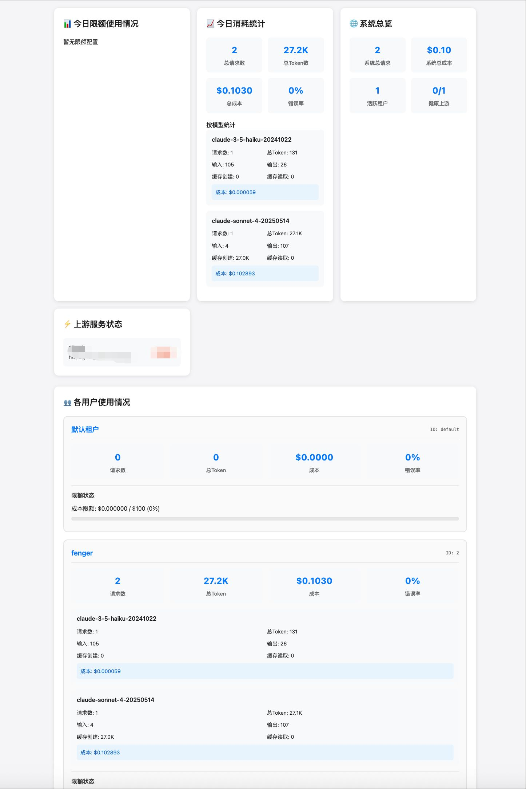
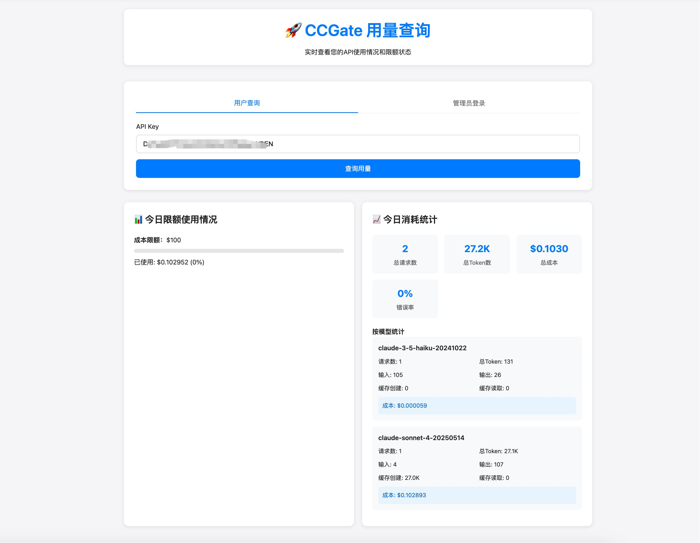

# CCGate

A secondary distribution reverse proxy server for Claude code API, supporting multiple upstream servers (Anthropic official and various Claude code mirror sites), multiple load balancing algorithms, multi-tenant configuration with permissions, and usage tracking for each tenant. **The tenant side provides both Claude API and OpenAI API standard interfaces**, seamlessly compatible with any application supporting these two protocols.

A question answered: With the powerful [Wei-Shaw/claude-relay-service](https://github.com/Wei-Shaw/claude-relay-service) already available for building Claude code mirror sites, why is this project still needed?

Because CRS upstream only supports configuration with Claude account login, requiring official subscription purchases and not supporting mirror site APIs. In scenarios where **a few friends or family members have low usage and want to avoid the instability of Claude account suspensions** (requiring frequent searches for available credit cards and IPs in different regions), and prefer to delegate this issue to mirror sites, they can purchase APIs from various Claude code mirror sites and use this project for secondary mirroring.

### Use Cases
- Purchased Claude code mirror site API keys and want to redistribute them to family and friends
- Want to convert Claude code keys for use with OpenAI-compatible protocol applications, such as Cline, NextChat, etc.
- High usage scenarios requiring load balancing across multiple Claude code mirror sites without frequent key switching

## ✨ Features

- 🚀 **High Performance Proxy** - Based on Node.js native HTTP module, supports streaming responses
- 🏢 **Multi-tenant Management** - Support for multiple tenants with independent usage and permission isolation
- 🔌 **Dual Protocol Support** - Provides both Claude API and OpenAI API interfaces, compatible with various applications
- ⚖️ **Load Balancing** - Supports multiple load balancing strategies and automatic failover
- 📊 **Usage Statistics** - Precise token-level metering and cost tracking
- 🔐 **Access Control** - API Key-based authentication and model access control
- 💰 **Cost Management** - Supports daily usage limits and real-time cost monitoring
- 🔍 **Health Checks** - Upstream server health monitoring and automatic switching

## 🚀 Quick Start

### Requirements

- Node.js >= 14.0.0
- npm or pnpm

### Installation

```bash
# Clone the project
git clone https://github.com/fengerwoo/CCGate.git
cd CCGate

# Install dependencies (pnpm recommended)
pnpm install
# or use npm
npm install
```

### Configuration

Copy configuration example files and modify them:

```bash
# Copy server configuration
cp config/server.json.example config/server.json

# Copy upstream server configuration
cp config/upstreams.json.example config/upstreams.json

# Copy tenant configuration
cp config/tenants.json.example config/tenants.json
```

#### 1. Configure Upstream Servers (`config/upstreams.json`)

```jsonc
{
  "upstreams": [                        // Multiple upstreams can be configured
    {
      "id": "upstream-1",                        // Unique identifier for upstream server
      "name": "Claude API Server",              // Server display name
      "url": "https://api.anthropic.com",       // API server address
      "key": "sk-your-api-key",                // API key
      "description": "Official Claude API",     // Server description
      "weight": 100,                           // Load balancing weight (higher values get more traffic)
      "enabled": true                          // Whether to enable this upstream server
    }
  ],
  "loadBalancer": {
    "strategy": "weighted_round_robin",        // Load balancing strategy, generally weighted_round_robin is sufficient, see "Load Balancing Strategies" at the bottom: weighted_round_robin/round_robin/random/least_connections
    "healthCheckEnabled": true,               // Whether to enable health checks
    "failoverEnabled": true                   // Whether to enable failover
  }
}
```

#### 2. Configure Tenants (`config/tenants.json`)

```jsonc
{
  "tenants": [                         // Multiple tenants can be configured
    {
      "id": "tenant-1",                         // Unique tenant identifier
      "name": "fenger",                        // Tenant display name
      "key": "your-unique-api-key",           // Tenant-specific API key (clients use this key for access)
      "enabled": true,                        // Whether to enable this tenant
      "allowedModels": ["*sonnet*", "*haiku*"], // Allowed models (supports * as wildcard)
      "limits": {
        "daily": {
          "maxUSD": 100.0                     // Daily maximum spending limit (USD)
        }
      }
    }
  ]
}
```

#### 3. Change Administrator Password (`config/server.json`)

⚠️ **Important: Change the default administrator password**

```jsonc
{
  "admin": {
    "enabled": true,                          // Whether to enable admin panel
    "path": "/admin",                        // Admin panel access path
    "username": "admin",                     // Administrator username
    "password": "your-secure-password"       // Administrator password (please modify this)
  }
}
```

### Start Service

```bash
# Development mode (auto-restart)
pnpm run dev
# or npm run dev

# Production environment
pnpm start
# or npm start

# Direct start
node server.js
```

### Client Usage

#### 1. Claude Code Official Client

🔥 **Proxy Address**: `http://localhost:3000/anthropic`

```bash
export ANTHROPIC_BASE_URL=http://localhost:3000/anthropic
export ANTHROPIC_AUTH_TOKEN=sk-your-tenant-key
```
This interface is compatible with all third-party applications and client tools supporting Claude API.

#### 2. OpenAI Compatible Applications

🔥 **Compatible Interface**: `http://localhost:3000/openai`

Can be used in any application supporting OpenAI API. Simply set the API key to the tenant key for seamless Claude API calls.

#### 3. Streaming Response Support

Both protocol endpoints (`/anthropic` and `/openai`) fully support streaming and non-streaming response modes.

## 📊 Usage Inquiry

Usage dashboard: `http://localhost:3000/dashboard`

### Administrator View

- Username: `admin` (configured in `config/server.json`)
- Password: **Please modify the default password**
- Administrators can view overall information and real-time usage of all tenants



### Tenant View

Use tenant API Key to query their own usage statistics.



## 🔧 Additional Settings

### API Endpoints

- `POST /anthropic` - Claude code proxy URL
- `GET /health` - Health check
- `POST /usage` - Usage inquiry API

## 📋 Available Commands

```bash
# Development related
pnpm run dev              # Start in development mode (auto-restart)
pnpm start               # Start in production environment

# Utility commands
pnpm run config:validate # Validate configuration files
pnpm run health          # Check service health status
pnpm run clean           # Clean logs and usage data
```

### Usage Data

Usage data is automatically stored in the following structure:

```
data/usage/
└── {tenant-id}/
    └── {YYYY-MM}/
        └── {YYYY-MM-DD}.json
```

Each file contains detailed usage statistics for that tenant on that day.

## ⚙️ Configuration Details

### Load Balancing Strategies (`config/upstreams.json`)

- `round_robin` - Round robin
- `weighted_round_robin` - Weighted round robin (recommended)
- `random` - Random selection
- `least_connections` - Least connections

### Model Permission Control (`config/tenants.json`)

Use wildcards in tenant configuration to control model access:

```jsonc
{
  "allowedModels": [
    "*sonnet*",    // Allow all Sonnet models
    "*haiku*",     // Allow all Haiku models
    "*"            // Allow all models
  ]
}
```

### OpenAI Model Mapping Configuration (`config/server.json`)

```jsonc
{
  "openai": {
    "enabled": true,                        // Whether to enable OpenAI compatible interface
    "models": {			                    // Model mapping list, can be modified according to your needs
      "gpt-5-nano": "claude-3-5-haiku-20241022",
      "gpt-5-mini": "claude-3-7-sonnet-20250219",
      "gpt-5-low": "claude-sonnet-4-20250514",
      "gpt-5-high": "claude-opus-4-20250514",
      "gpt-5-high-fast": "claude-opus-4-1-20250805"
    },
    "defaultModel": "claude-sonnet-4-20250514"        // Default model (used when client doesn't specify a mapped model)
  }
}
```

With this configuration, clients using the OpenAI compatible interface `/openai` can use custom model names (like `gpt-5-mini`) to call corresponding Claude models.

### Usage Limits

Supports multi-level usage limits:

```jsonc
{
  "limits": {
    "daily": {
      "maxUSD": 100.0,      // Daily maximum cost (USD)
    }
  }
}
```

## 🔍 Troubleshooting

### Common Issues

1. **Service won't start**
   - Check if port 3000 is occupied
   - To modify listening port, change config/server.json -> server.port configuration
   - Validate configuration file format: `pnpm run config:validate`

2. **Authentication failed**
   - Confirm tenant API Key is correctly configured
   - Check if tenant is enabled: `"enabled": true`

3. **Upstream connection failed**
   - Check upstream server URL and API Key
   - View health check status: `pnpm run health`

4. **Usage statistics abnormal**
   - Check `data/usage/` directory permissions
   - View service logs: `tail -f data/logs/combined.log`

### Log Locations

- Combined log: `data/logs/combined.log`
- Error log: `data/logs/error.log`
- Access log: `data/logs/access.log`

## 📄 License

ISC

## 🤝 Contributing

Issues and Pull Requests are welcome!

---

⭐ If this project helps you, please give it a star for support!